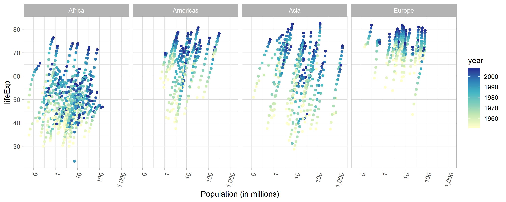

* [Introduction](#introduction)
    * [Load Packages](#load-packages)
* [Part 1: Factor Management](#part-1-factor-management)
* [Part 2: File I/O](#part-2-file-io)
* [Part 3: Visualization Design](#part-3-visualization-design)
    * [Remake a Past Figure](#remake-a-past-figure)
    * [Improving a Figure Using Plotly](#improving-a-figure-using-plotly)
* [Part 4: Writing Figures to File](#part-4-writing-figures-to-file)
* [But I Want to Do More!](#but-i-want-to-do-more)

## Introduction

Goals:

  * Reorder a factor in a principled way based on the data and demonstrate the effect in arranged data and in figures.
  * Write some data to file and load it back into R.
  * Improve a figure (or make one from scratch), using new knowledge, e.g., control the color scheme, use factor levels, smoother mechanics.
  * Make a plotly visual.
  * Implement visualization design principles.

### Load Packages

```{r loadPackages, message=FALSE, warning=FALSE}
library(tidyverse)
library(forcats)
library(gapminder)
library(scales)
library(plotly)
library(knitr)
```

## Part 1 Factor management

Elaboration for the gapminder data set
Drop Oceania. Filter the Gapminder data to remove observations associated with the continent of Oceania. Additionally, remove unused factor levels. Provide concrete information on the data before and after removing these rows and Oceania; address the number of rows and the levels of the affected factors.

```{r propertiesGapminder}
str(gapminder)
```

We can see that:

  * There are 1704 rows
  * Country and continent are the only factor type variables, with 142 and 5 levels respectively.
  
```{r factorAdjustGapminder}
gapminderReduced <- gapminder %>% 
  filter(continent != "Oceania") %>% 
  mutate(country = fct_drop(country),
         continent = fct_drop(continent))

str(gapminderReduced)
```

Now we can see that:

  * There are only 1680 rows, 24 rows fewer than the initial gapminder dataset
  * country and continent now have 140 and 4 levels, respectively.
  
Let's try to reorder the levels so they are not in alphabetical order, but rather in order of descending minimum life expectancy, so that we can make a better looking plot.

```{r plotGapminderReduced}
gapminderReduced %>% 
  mutate(continent = fct_reorder(continent, lifeExp, .fun= min, .desc = TRUE)) %>% 
  ggplot(aes(continent, lifeExp)) +
  geom_boxplot() +
  theme_light()
```


## Part 2 File IO

Experiment with one or more of write_csv()/read_csv() (and/or TSV friends), saveRDS()/readRDS(), dput()/dget(). Create something new, probably by filtering or grouped-summarization of Singer or Gapminder. I highly recommend you fiddle with the factor levels, i.e. make them non-alphabetical (see previous section). Explore whether this survives the round trip of writing to file then reading back in.

Let's play around with the gapminder dataset, making a summary of the average life expectancy, in each continent (overall), re-order the factor levels of continent (in descending order of mean life expectancy), write the data to .csv, read the data from the .csv, and see if this factor modification has remained!

```{r createGapminderSummary}
gapminderSummary <- gapminder %>% 
  group_by(continent) %>% 
  summarize(LifeExpMean = mean(lifeExp)) %>% 
  mutate(continent = fct_reorder(continent, LifeExpMean, .desc = TRUE))

levels(gapminderSummary$continent)
```

```{r readWriteDecribeGapminderSummary}
#Set row.names=FALSE to prevent creation of column of data labelling observations
write.csv(gapminderSummary, "stat545_hw05_gapminder_summary.csv", row.names = FALSE)
gapminderSummaryRead <- read.csv("stat545_hw05_gapminder_summary.csv")

str(gapminderSummaryRead)
levels(gapminderSummaryRead$continent)
```

So we can see that no, the re-ordering of factor levels does not survive the read/write process!

## Part 3 Visualization design

### Remake a past figure

In Homework 2, I made the following figure:

```{r originalFigure, fig.width=10, fig.height=4}
ggplot(gapminder, aes(x=pop, y=lifeExp)) +
  scale_x_log10() +
  facet_grid( ~ continent) +
  geom_point()
```

To improve this figure I'm going to attempt to:

* Remove Oceania, to allow for more room for the other plots
* Fix the x-axis so the values are readable
* Add more labels to the y-axis
* Change the theme to remove the grey background
* Colour the points according to the year

```{r improvedFigure, fig.width=10, fig.height=4}
lifeExpPlot <- gapminder %>% 
  filter(continent != "Oceania") %>% 
  ggplot(aes(x=pop / 1000000, y=lifeExp)) +
    facet_grid( ~ continent) +
    geom_point(aes(colour = year)) +
    labs(x = "Population (in millions)") +
    scale_x_log10(labels = comma_format()) +
    scale_y_continuous(breaks=10*(1:10)) +
    scale_color_distiller(
      palette = "YlGnBu", 
      direction = 1) +
    theme_light() +
    theme(axis.text.x = element_text(angle = 70, hjust = 1)) #changes angle of x axis value labels
lifeExpPlot
```

### Improving a Figure Using Plotly

Let's see if we can use plotly to help further improve this plot:

```{r plotlyLifeExpvsPop}
gapminder %>%
  plot_ly(
    x = ~pop, 
    y = ~lifeExp, 
    color = ~continent, 
    frame = ~year,         #Specifies what the animation frame is
    text = ~country, 
    hoverinfo = "text",
    type = 'scatter',
    mode = 'markers') %>%
  layout(
    xaxis = list(type = "log"))
```

With this animated plot we're able to definitively see the trend between population size and life expectancy over time. In general we can see that both population size and life expectancy are increasing, however we can also see there are many African countries that experience great dips in life expectancy in the '90s. Let's investigate this further with a line plot of life expectancy over time, in African countries:

```{r plotlyAfrica, message=FALSE, warning=FALSE}
gapminder %>%
  filter(continent == "Africa") %>% 
  plot_ly(
    x = ~year, 
    y = ~lifeExp, 
    color = ~country, 
    type = 'scatter',
    mode = 'lines') 
```

Thanks to this being a plotly plot, we're able to hover over line series to identify what country corresponds to each line unambiguously. We are also able to de-select lines from displaying on the graph, zoom into areas of interest, and examing single lines at a time (apparently by double-clicking, but I've had difficulty getting this to reliably work).

## Part 4 Writing figures to file
Use ggsave() to explicitly save a plot to file. Then use to load and embed it in your report. You can play around with various options, such as:

Arguments of ggsave(), such as width, height, resolution or text scaling.
Various graphics devices, e.g. a vector vs. raster format.
Explicit provision of the plot object p via ggsave(..., plot = p). Show a situation in which this actually matters.

Let's save the improved ggplot made in section 3. Note that this figure is quite wide, so we must specify the dimensions when saving it, otherwise it comes out looking quite squished. Let's experiment by saving the file  in both .PNG, and .JPEG formats. Then let's see which survives import and re-sizing better!

```{r ggsaveCalls}
ggsave(filename = "stat545_hw5_LifeExpbyContinent.png", lifeExpPlot, height = 4, width = 10)
ggsave(filename = "stat545_hw5_LifeExpbyContinent.jpeg", lifeExpPlot, height = 4, width = 10)
```

So this is the original JPEG version:



And this is the original .png version:


Then these are the squished versions.
```{r showFiguresReducedSize, out.width= "50%"}
#The figures will be reduced size due to chunk header specifying out.width = "50%"


```

To be honest, I can't see a noticeable difference in the quality of these two graphs. This is surprising as we'd expect the version stored as a vector type image would responde better to re-sizing. For me, I think this shows that the greater take home message is to save plots in similar sizes and resolutions to that which you will want to use them in. 

## But I Want to Do More

For this, I'd like to explore the functions of `forcats` more. First, let's try deriving a new data frame that includes a new factor level variable derived from the `country` variable in the gapminder dataset. Given my *incredibly* limited knowledge of geography, making a filtered dataset that includes all countries I confidently know the capitals of, is quite manageable. 

```{r factorAdjustmentExtra}
knownCapitals <- gapminder %>% 
  filter(country %in% c("Canada", 
                        "United Kingdom", 
                        "France", 
                        "United States", 
                        "Argentina", 
                        "Norway")) %>% 
  mutate(country = fct_drop(country),
         capitals = fct_recode(country,
                               Ottawa = "Canada",
                               London = "United Kingdom",
                               Paris = "France",
                               Washington = "United States",
                               `Buenos Aires` = "Argentina",
                               Oslo = "Norway"))

str(knownCapitals)
```

Awesome, so our new data frame includes 6 countries, with a new variable for the capital of each country. The country variable has also been collapsed to remove countries I don't know the capitals of.

Let's try re-ordering these factors for the sake of a plot. Let's plot these based on the latitude of each capital, and see if we can see a trend in life expectancy.

```{r plottingKnownCapitals}
knownCapitals %>% 
  mutate(capitals = fct_relevel(capitals, 
                                "Oslo", 
                                "London", 
                                "Paris", 
                                "Ottawa", 
                                "Washington", 
                                "Buenos Aires")) %>% 
  ggplot(aes(capitals, lifeExp)) +
    geom_boxplot()
```

Cool! So now we can see that there might be a downwards trend of life expectancy as the capital of the country is located further south. This is a super biased conclusion though, as the dataset we're using is very incomplete!